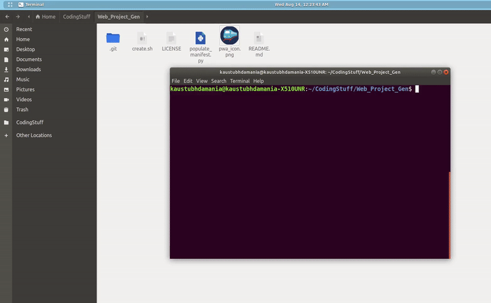

<h3 align="center">PWA-Maker</h3>
 

------------------------------------------

> Many times during hackathons or projects, we first make the Web App then convert it into a PWA if required.

> We select an icon, then convert it into various sizes as required for PWA and then add the serviceworker and manifest files.

> This script automates this boring process by generating a basic PWA website template, along with a GUI interface for selecting the icon and automatically resizing it in different sizes for PWA.

------------------------------------------

### Demo
 

------------------------------------------

Made with :heart: by <a href="https://github.com/KaustubhDamania" target="_blank">Kaustubh Damania</a>

